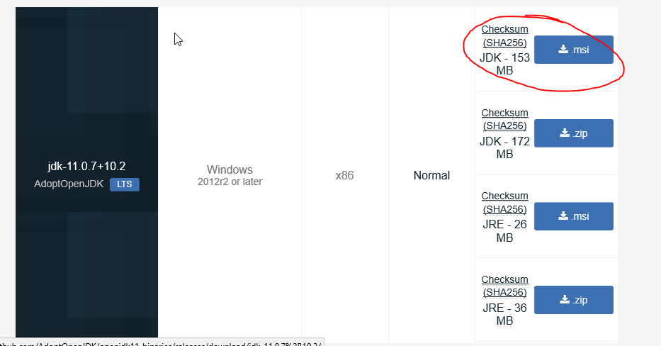
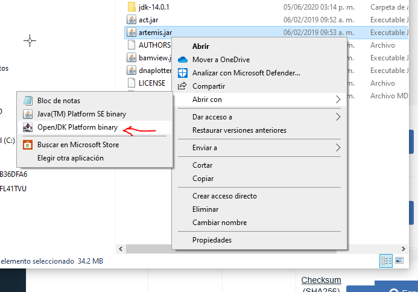

# Instalar/Ejecutar Java para usar con Artemis

## Descargar Artemis

Como no está en la guía lo agrego acá

1. Descargar Artemis [desde acá](https://github.com/sanger-pathogens/Artemis/releases/download/v18.1.0/artemis-windows-release-18.1.0.zip) o desde la página de [artemis oficial](http://sanger-pathogens.github.io/Artemis/Artemis/) del Sanger Institute, haciendo click en la plataforma deseada
2. Una vez descargado tendremos un zip. Descomprimirlo en la carpeta en la que queramos que quede el programita
3. Ejecutar según corresponda a su sistema operativo (ver debajo)

## Ejecutar artemis

Dada la amplia diversidad de compus (y la consiguiente variabilidad de versiones de sistemas operativos y bits en sus PCs), armo este documento para que puedan encontrar al menos una alternativa que les funcionen los programas que dependen de Java. Espero sea el caso y, sino, escríbannos con el/los errores que ven y buscamos una solución particular.

Para evitar problemas de virtualización, voy a describir cómo hacerlo andar en Windows (puesto que es posible que el error que vimos en Ubuntu tenga que ver con la capacidad de virtualización, y ya contra eso no podemos hacer nada :c ). Aunque agrego la parte de Ubuntu que debería funcionar, para futuras generaciones.

### Ubuntu 14 a 18 

1. Abrir una consola
2. Instalar Java Runtime Environment `sudo apt-get install default-jre` y aceptar todos los cambios.
3. En la consola, posicionarse en la carpeta de Artemis y tipear, `./artemis` o `./art` (el ejecutable varía según la versión, verifiquen cuál de esos tienen haciendo `ls` dentro de la carpeta)
   
Normalmente, esto debería funcionar. Pero si no funciona (¡como ya hemos visto!), puede que tengamos un problema de virtualización y tengamos que mudarnos a Windows :poop:

### Windows 7 a 10 

#### La fácil

1. Ir a la página de [AdoptJDK](https://adoptopenjdk.net/releases.html).
2. Seleccionen alguna de las versiones con LTS (Long Term Support). Recomiendo arrancar con la 14 y si esa no funciona, bajar a la 11 (y por último a la 8, en el peor de los casos)
3. En _Operating System_ seleccionen "Windows" y, en Arquitectura, "x64" para 64 bits o "x86" para 32 bits. 
4. Entre las opciones que aparecen para descargar, descargamos el JDK con extensión ``.msi``. 



5. Cuando esté listo, ejecutamos y seguimos los pasos que dicta el instalador
6. Cuando finalice, podremos ``Artemis.jar`` con la plataforma JDK. Acá es importante que, al ejecutar, no estemos usando un versión de Java que ya teníamos instalada. Para eso, podemos darle ``click derecho`` > ``Abrir con`` > ``OpenJDK Platform binary``

. 


#### La difícil (Esta solo me funcionó en Windows 64 Bits )

Si nada de eso funciona, pueden probar con esto:

1. Descargar [JDK 14.0.1](https://download.java.net/java/GA/jdk14.0.1/664493ef4a6946b186ff29eb326336a2/7/GPL/openjdk-14.0.1_windows-x64_bin.zip) desde ese link o desde la [página oficial de JDK](https://jdk.java.net/14/), haciendo click en el "zip" de Windows.
2. Una vez descargado tendremos un archivo .zip. Lo colocaremos dentro de la carpeta de Artemis y lo descomprimimos usando cualquier gestor de archivos comprimidos.
3. Ahora abrimos una consola de Windows (`Windows`+`R`, escribimos `cmd` y le damos a `ejecutar`)
4. En la consola que se abre, navegaremos hasta la carpeta de Artemis, usando `cd`, como en UNIX. Por ejemplo: `cd C:\Users\RYZEN\Desktop\artemis>`
5. Una vez allí ejecutaremos el comando ():
```
    "./jdk-14.0.1/bin/java.exe" -jar artem  is.jar    
```
Nótese que lo que estamos haciendo es usar el ejecutable de JDK y pasándole el programa ``artemis.jar`` como parámetro. Revisen que la ruta al archivo ``java.exe`` coincida con lo que tienen ustedes en sus carpetas:


